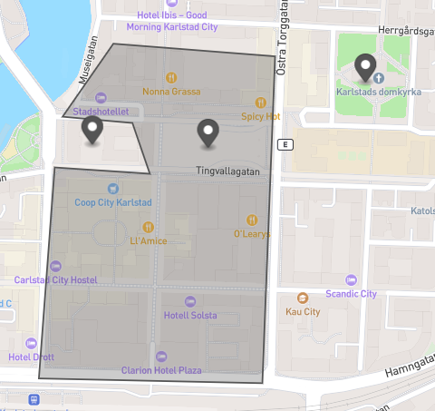

# Test med punkter och polygoner

Det här är bara ett litet test att se hur man kan kolla om en punkt är inom en polygon och returenrar true eller false. Testar två olika npm paket där man endast använder koordinaterna. Sättet man använder de på är likvärdiga.

Testa
```
npm install
node index.js
```

Ger utskri
```
# geo-point-in-polygon
Innanför true
Knappt utanför false
Utanför false

# point-in-polygon
Innanför true
Knappt utanför false
Utanför false
```

## geo-point-in-polygon
Paket utan dependencies, unpacked 13.4 kB. [Länk](https://www.npmjs.com/package/geo-point-in-polygon)

## point-in-polygon
Paket med 1 dependency, unpacked 8.7 kB. [Länk](https://www.npmjs.com/package/point-in-polygon)

## Bild på polygonen och punkterna

